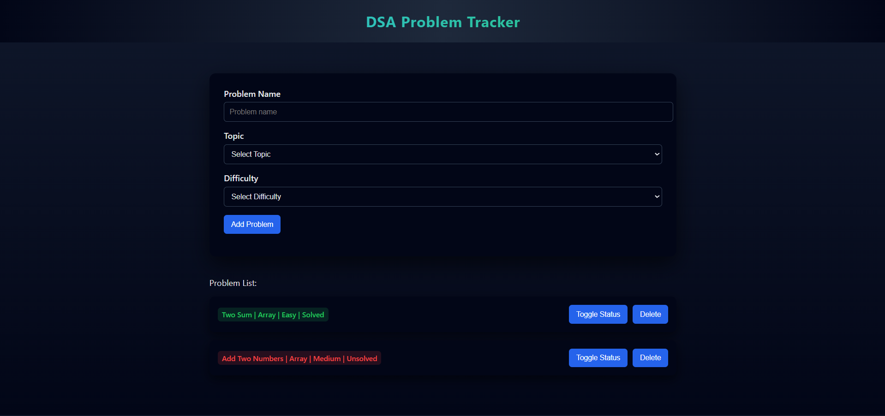
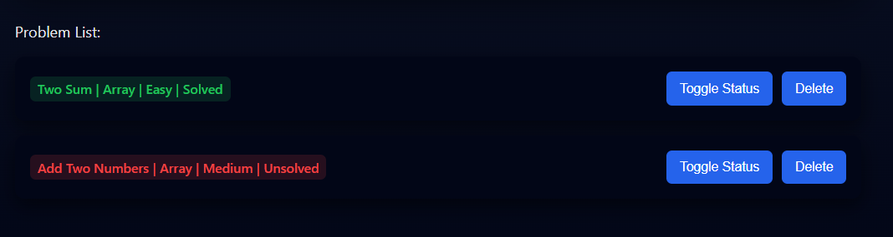

# DSA Problem Tracker

A simple and clean web-based application to track Data Structures and Algorithms (DSA) problems by topic, difficulty, and completion status.

## Features
- Add DSA problems with topic and difficulty
- Mark problems as Solved or Unsolved
- Delete problems from the list
- Data persistence using LocalStorage
- Clean and modern dark-mode UI

## Tech Stack
- HTML
- CSS
- JavaScript (Vanilla JS)
- Browser LocalStorage

## How to Run
1. Clone or download the repository
2. Open `index.html` in any modern web browser
3. Start adding and tracking problems

## Screenshots

### Main Interface

### Problem List

## Learning Outcomes
- DOM manipulation using JavaScript
- Event handling and state management
- LocalStorage for client-side persistence
- Separation of logic and UI styling
